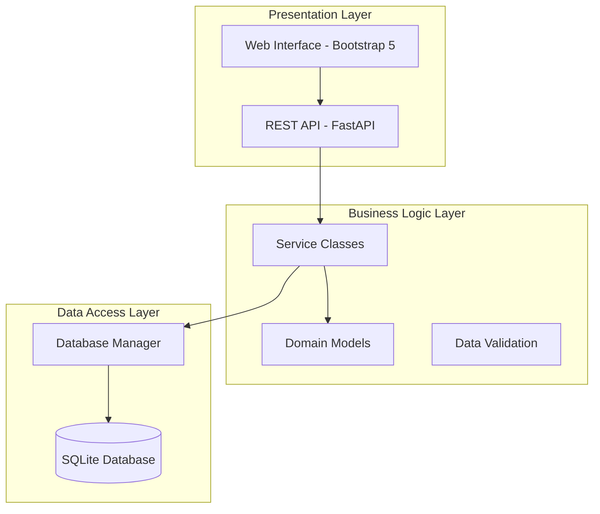
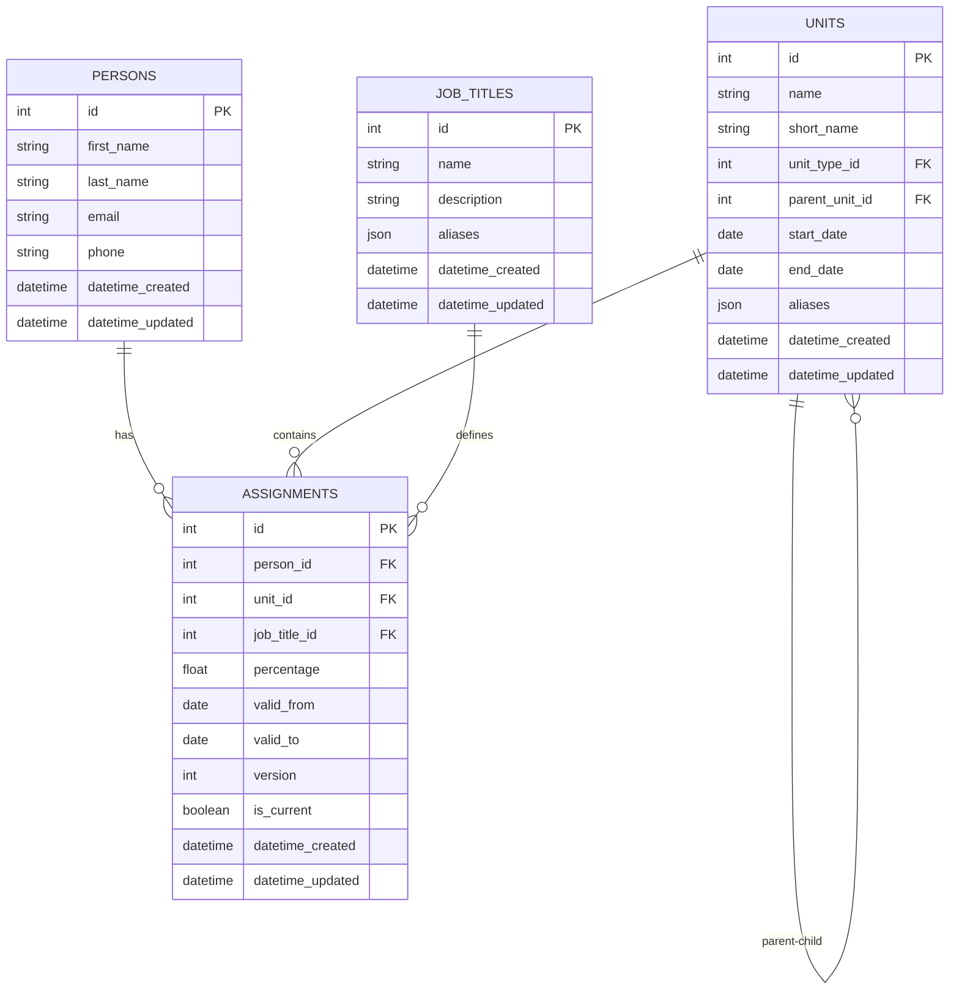
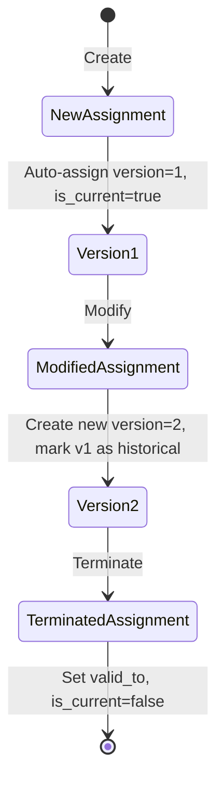
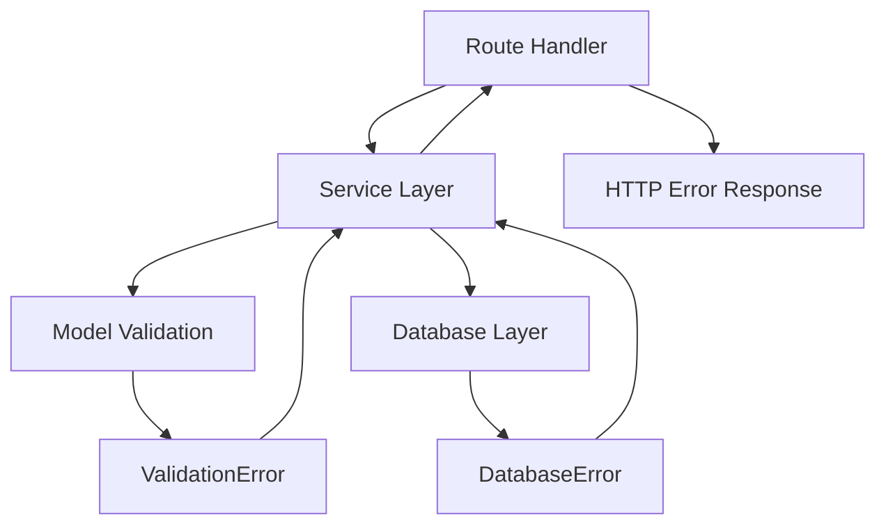
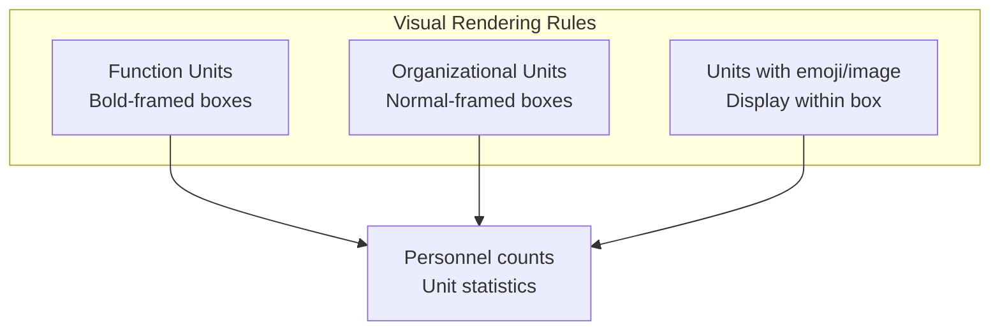
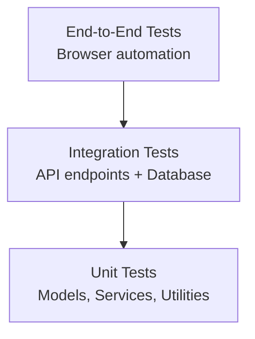

# Design Document

## Overview

The Organigramma Web App is a comprehensive organizational chart management system built using modern web technologies. The system follows a layered architecture pattern with clear separation of concerns, implementing Domain-Driven Design principles with a focus on maintainability, scalability, and user experience.

The application serves as a centralized platform for managing organizational structures, personnel data, job assignments, and their historical evolution through automatic versioning capabilities. The design directly addresses all eight core requirements: robust database management with referential integrity, responsive WCAG-compliant web interface, comprehensive CRUD operations, automatic assignment versioning, comprehensive logging and error handling, interactive organizational chart visualization with specific rendering rules, modular architecture, and configurable deployment with security-by-design and security-by-default principles.

## Architecture

### High-Level Architecture

The system follows a **3-tier architecture** pattern:



### Technology Stack

- **Backend Framework**: FastAPI (Python 3.8+)
- **Database**: SQLite with foreign key constraints and row factory
- **Template Engine**: Jinja2
- **Frontend Framework**: Bootstrap 5 + Vanilla JavaScript (WCAG 2.1 AA compliant)
- **Server**: Uvicorn (ASGI) / Gunicorn for production
- **Testing**: pytest + httpx
- **Logging**: Python logging module with file and console handlers
- **Configuration**: Environment-based configuration via .env files
- **Security**: Input validation, SQL injection prevention, secret management, security-by-design principles

### Architectural Patterns

1. **Repository Pattern**: Centralized database access through DatabaseManager
2. **Service Layer Pattern**: Business logic encapsulated in service classes
3. **Model-View-Controller (MVC)**: Clear separation of concerns
4. **Dependency Injection**: FastAPI's dependency system for service management
5. **Template Method Pattern**: BaseService provides common CRUD operations

## Components and Interfaces

### Core Components

#### 1. Database Manager (`app/database.py`)

**Responsibilities:**

- Singleton pattern for database connection management
- Connection pooling and cleanup
- Transaction management
- Schema initialization and migration

**Key Methods:**

```python
class DatabaseManager:
    def get_connection() -> contextmanager
    def execute_query(query: str, params: tuple) -> cursor
    def fetch_one(query: str, params: tuple) -> Row
    def fetch_all(query: str, params: tuple) -> List[Row]
    def execute_script(script_path: Path) -> None
    def initialize_database() -> None  # Schema initialization with error handling
    def enable_foreign_keys() -> None  # Enforce referential integrity
```

**Design Rationale**: The DatabaseManager implements a singleton pattern to ensure consistent database connections and enforces foreign key constraints as required by Requirement 1. The row factory enables dict-like access to query results, improving developer experience and data handling. Database initialization includes proper error handling and logging to prevent application startup on failure, directly addressing Requirement 1 acceptance criteria. Connection pooling and transaction management ensure data integrity and system reliability.

#### 2. Base Model (`app/models/base.py`)

**Responsibilities:**

- Common model functionality and audit fields
- Serialization/deserialization utilities
- Validation framework
- Multilingual alias support

**Key Features:**

```python
@dataclass
class BaseModel:
    datetime_created: Optional[datetime]
    datetime_updated: Optional[datetime]
    
    def to_dict() -> Dict[str, Any]
    def from_dict(data: Dict) -> BaseModel
    def from_sqlite_row(row) -> BaseModel
    def validate() -> List[ValidationError]
```

#### 3. Domain Models

**UnitType Model** (`app/models/unit_type.py`):

- Type classification (function/OrganizationalUnit)
- Multilingual aliases support

**Unit Model** (`app/models/unit.py`):

- Hierarchical organizational structure
- Unit types with foreign key relationships
- Date-based validity periods
- Multilingual aliases support

**Person Model** (`app/models/person.py`):

- Personnel information management
- Email validation
- Contact details

**Job Title Model** (`app/models/job_title.py`):

- Role definitions
- Multilingual support
- Hierarchical classification

**Assignment Model** (`app/models/assignment.py`):

- Person-to-role assignments with foreign key relationships
- Automatic versioning system with version numbering and is_current flag
- Percentage-based assignments (0.0 to 1.0 range)
- Temporal validity tracking with valid_from and valid_to dates
- Historical data preservation through versioning mechanism

**Design Rationale**: The Assignment model implements comprehensive versioning as required by Requirement 4, ensuring complete history tracking of organizational changes. Each assignment modification creates a new version while preserving historical data, with the is_current flag enabling efficient querying of active assignments.

#### 4. Service Layer

**Base Service** (`app/services/base.py`):

- Abstract base class for all services
- Common CRUD operations
- Search functionality
- Validation integration

**Specialized Services**:

- `UnitService`: Hierarchical operations, tree building
- `PersonService`: Personnel management, contact validation
- `JobTitleService`: Role management, multilingual support
- `AssignmentService`: Versioning logic, historical tracking
- `OrgchartService`: Tree visualization, statistics

#### 5. Route Handlers

**Organization by Feature**:

- `home.py`: Dashboard and statistics
- `unit_types.py`: Unit type management endpoints
- `units.py`: Unit management endpoints
- `persons.py`: Personnel management endpoints
- `job_titles.py`: Role management endpoints
- `assignments.py`: Assignment management endpoints
- `orgchart.py`: Visualization endpoints
- `api.py`: REST API endpoints

**Security and Accessibility Features**:

- Input validation middleware
- WCAG accessibility directives compliance in templates (Requirement 2)
- Custom error pages (404, 500) with proper status codes (Requirement 5)
- Security headers and CSRF protection
- Security-by-design and security-by-default implementation (Requirement 8)

### Interface Contracts

#### Service Interface Pattern

```python
class BaseService(ABC):
    @abstractmethod
    def get_list_query() -> str
    @abstractmethod
    def get_by_id_query() -> str
    @abstractmethod
    def get_insert_query() -> str
    @abstractmethod
    def get_update_query() -> str
    @abstractmethod
    def get_delete_query() -> str
```

#### Model Interface Pattern

```python
class BaseModel:
    def validate() -> List[ValidationError]
    def to_dict() -> Dict[str, Any]
    @classmethod
    def from_sqlite_row(row) -> BaseModel
```

## Data Models

### Entity Relationship Diagram



### Data Model Specifications

#### Assignment Versioning Logic



#### Hierarchical Unit Structure

- **Root Units**: parent_unit_id = NULL or -1
- **Child Units**: parent_unit_id references parent unit
- **Validation**: Prevent circular references
- **Computed Fields**: level, path, full_path for tree operations

### Data Validation Rules

1. **Units**:
   - Name is required and non-empty
   - End date must be after start date
   - Foreign key constraints
   - Cannot be self-parent

2. **Persons**:
   - Email format validation
   - First and last name required
   - Unique email constraint

3. **Assignments**:
   - Percentage between 0.0 and 1.0
   - Valid date ranges
   - Foreign key constraints
   - Version consistency

## Error Handling

### Error Handling Strategy

#### 1. Layered Error Handling



#### 2. Error Types and Responses

**Validation Errors** (400 Bad Request):

```python
class ModelValidationException(Exception):
    def __init__(self, errors: List[ValidationError])
```

**Not Found Errors** (404 Not Found):

- Entity not found by ID
- Custom 404 error page

**Database Errors** (500 Internal Server Error):

- Connection failures
- Constraint violations
- Transaction rollbacks

**Application Errors** (500 Internal Server Error):

- Unexpected exceptions
- Custom 500 error page

#### 3. Error Logging Strategy

```python
# Service Layer Logging
logger.error(f"Error creating {self.table_name}: {e}")

# Database Layer Logging  
logger.error(f"Database error: {e}")

# Route Layer Logging
logger.error(f"Server error: {exc}")

# Application Lifecycle Logging
logger.info("Application starting up")
logger.info("Database initialized successfully")
logger.info("Application shutting down")
```

**Design Rationale**: Comprehensive logging strategy addresses Requirement 5 acceptance criteria by ensuring both console and file logging, detailed error information for database operations, and lifecycle event logging for application startup and shutdown monitoring.

### Recovery Mechanisms

1. **Database Transactions**: Automatic rollback on errors
2. **Connection Management**: Proper cleanup in finally blocks
3. **Graceful Degradation**: Fallback to empty results on search failures
4. **User Feedback**: Clear error messages in UI

## Organizational Chart Visualization

### Visual Design Requirements

The organizational chart component provides an interactive tree-like visualization of the company structure with specific rendering requirements:

#### Unit Type Rendering



**Design Rationale**: Different visual treatments help users quickly distinguish between functional roles and organizational structures, improving navigation and understanding. This directly addresses Requirement 6 acceptance criteria 6-8 for specific rendering rules based on unit types and emoji/image display.

#### Interactive Features

- **Hierarchical Navigation**: Click-to-expand/collapse functionality
- **Unit Statistics**: Real-time personnel counts and assignment data
- **Visual Hierarchy**: Clear parent-child relationships with connecting lines
- **Responsive Design**: Adapts to different screen sizes while maintaining readability

#### Performance Considerations

- **Lazy Loading**: Load unit details on demand for large organizations
- **Caching Strategy**: Cache organizational structure for improved response times
- **Progressive Enhancement**: Basic functionality without JavaScript, enhanced with interactive features

## Configuration and Deployment

### Environment-Based Configuration

The system supports flexible deployment through environment-based configuration following security-by-design principles:

#### Configuration Management

```python
# Environment Configuration Structure
class Settings:
    database_url: str = "sqlite:///data/orgchart.db"
    debug_mode: bool = False
    log_level: str = "INFO"
    secret_key: str  # Required for security
    allowed_hosts: List[str] = ["localhost"]
    cors_origins: List[str] = []
    
    # Logging Configuration
    log_to_console: bool = True
    log_to_file: bool = True
    log_file_path: str = "app.log"
    
    # Database Configuration
    enable_foreign_keys: bool = True
    database_backup_enabled: bool = True
    backup_schedule: str = "daily"
```

**Design Rationale**: Environment-based configuration enables secure deployment across different environments (development, staging, production) without code changes. The configuration explicitly supports dual logging (console and file) as required by Requirement 5, and includes database backup management as specified in Requirement 8 acceptance criteria.

#### Security-by-Design Implementation

1. **Input Validation**: All user inputs validated at multiple layers
2. **SQL Injection Prevention**: Parameterized queries and ORM usage
3. **Secret Management**: Environment variables for sensitive data
4. **Security Headers**: CSRF protection, secure cookies, HTTPS enforcement
5. **Access Control**: Role-based permissions (future enhancement)

#### Deployment Patterns

**Development Environment**:

- SQLite database with debug logging
- Hot reload enabled
- Detailed error messages

**Production Environment**:

- Gunicorn with multiple workers
- Structured logging to files
- Error tracking and monitoring
- Database backup automation

**Cloud-Native Deployment**:

- Container-ready configuration
- Health check endpoints
- Horizontal scaling support
- External database connectivity

## Testing Strategy

### Testing Pyramid



### Test Categories

#### 1. Unit Tests (`tests/test_models.py`, `tests/test_services.py`)

**Model Tests**:

- Validation logic
- Serialization/deserialization
- Business rule enforcement
- Edge cases and boundary conditions

**Service Tests**:

- CRUD operations
- Business logic
- Error handling
- Mock database interactions

#### 2. Integration Tests (`tests/test_routes.py`)

**API Tests**:

- HTTP endpoint functionality
- Request/response validation
- Authentication/authorization
- Database integration

#### 3. Database Tests

**Schema Tests**:

- Foreign key constraints
- Trigger functionality
- Data integrity
- Migration scripts

#### 4. Frontend Tests

**JavaScript Tests**:

- Form validation
- AJAX interactions
- UI component behavior
- Cross-browser compatibility

### Test Configuration (`tests/conftest.py`)

```python
@pytest.fixture
def test_database():
    # Create temporary test database
    # Initialize schema
    # Provide cleanup
    
@pytest.fixture  
def test_client():
    # FastAPI test client
    # Mock dependencies
    # Test configuration
```

### Continuous Testing Strategy

1. **Pre-commit Hooks**: Run unit tests before commits
2. **CI/CD Pipeline**: Automated test execution
3. **Coverage Reporting**: Maintain >80% code coverage
4. **Performance Testing**: Response time benchmarks
5. **Security Testing**: Input validation and SQL injection prevention

### Test Data Management

- **Fixtures**: Reusable test data sets
- **Factories**: Dynamic test data generation
- **Cleanup**: Automatic test data cleanup
- **Isolation**: Each test runs in clean state
