# Template Interactions Flowchart

This document provides a comprehensive overview of how templates interact with each other in the Organigramma Web App, showing the navigation flow and template relationships.

## Template Structure Overview

The application follows a hierarchical template structure with:

- **Base templates** providing layout and navigation
- **Entity-specific templates** for CRUD operations
- **Specialized views** for orgchart visualization
- **Error handling templates** for graceful error display

## Template Interaction Flowchart

```mermaid
flowchart TD
    %% Base Layout Structure
    Layout["`**base/layout.html**
    Main layout with navigation,
    breadcrumbs, alerts, footer`"]
    
    Navigation["`**base/navigation.html**
    Main navigation menu
    with dropdowns`"]
    
    Footer["`**base/footer.html**
    Footer with modals
    and help information`"]
    
    %% Main Entry Points
    Dashboard["`**home/dashboard.html**
    Main dashboard with
    statistics and quick actions`"]
    
    %% Units Templates
    UnitsList["`**units/list.html**
    Units listing with
    table/hierarchy views`"]
    
    UnitsDetail["`**units/detail.html**
    Unit details with
    assignments and hierarchy`"]
    
    UnitsCreate["`**units/create.html**
    Unit creation form`"]
    
    UnitsEdit["`**units/edit.html**
    Unit editing form`"]
    
    %% Persons Templates
    PersonsList["`**persons/list.html**
    Persons listing with
    filters and search`"]
    
    PersonsDetail["`**persons/detail.html**
    Person details with
    assignments history`"]
    
    PersonsCreate["`**persons/create.html**
    Person creation form`"]
    
    PersonsEdit["`**persons/edit.html**
    Person editing form`"]
    
    PersonsAssignments["`**persons/assignments.html**
    Person's assignment history`"]
    
    PersonsWorkload["`**persons/workload.html**
    Person's workload analysis`"]
    
    %% Job Titles Templates
    JobTitlesList["`**job_titles/list.html**
    Job titles with
    table/cards views`"]
    
    JobTitlesDetail["`**job_titles/detail.html**
    Job title details`"]
    
    JobTitlesCreate["`**job_titles/create.html**
    Job title creation form`"]
    
    JobTitlesEdit["`**job_titles/edit.html**
    Job title editing form`"]
    
    JobTitlesAssignments["`**job_titles/assignments.html**
    Job title assignments`"]
    
    JobTitlesAssignableUnits["`**job_titles/assignable_units.html**
    Units where job title can be assigned`"]
    
    %% Assignments Templates
    AssignmentsList["`**assignments/list.html**
    Assignments with filters
    and statistics`"]
    
    AssignmentsDetail["`**assignments/detail.html**
    Assignment details`"]
    
    AssignmentsCreate["`**assignments/create.html**
    Assignment creation form`"]
    
    AssignmentsEdit["`**assignments/edit.html**
    Assignment editing form`"]
    
    AssignmentsHistory["`**assignments/history.html**
    Assignment version history`"]
    
    AssignmentsStatistics["`**assignments/statistics.html**
    Assignment statistics`"]
    
    AssignmentsBulkOps["`**assignments/bulk_operations.html**
    Bulk assignment operations`"]
    
    AssignmentsWorkloadReport["`**assignments/workload_report.html**
    Workload analysis report`"]
    
    %% Orgchart Templates
    OrgchartTree["`**orgchart/tree.html**
    Interactive organizational tree
    with zoom and filters`"]
    
    OrgchartOverview["`**orgchart/overview.html**
    Orgchart overview`"]
    
    OrgchartMatrix["`**orgchart/matrix.html**
    Matrix view of organization`"]
    
    OrgchartUnitDetail["`**orgchart/unit_detail.html**
    Unit in organizational context`"]
    
    OrgchartComparison["`**orgchart/comparison.html**
    Compare organizational states`"]
    
    OrgchartSimulation["`**orgchart/simulation.html**
    Simulate organizational changes`"]
    
    OrgchartGapAnalysis["`**orgchart/gap_analysis.html**
    Analyze organizational gaps`"]
    
    OrgchartSpanOfControl["`**orgchart/span_of_control.html**
    Span of control analysis`"]
    
    OrgchartStatistics["`**orgchart/statistics.html**
    Organizational statistics`"]
    
    OrgchartOrganizationalHealth["`**orgchart/organizational_health.html**
    Organizational health metrics`"]
    
    %% Error Templates
    Error404["`**errors/404.html**
    Page not found error`"]
    
    Error500["`**errors/500.html**
    Server error page`"]
    
    ErrorDatabase["`**errors/database.html**
    Database error page`"]
    
    ErrorValidation["`**errors/validation.html**
    Validation error page`"]
    
    %% Base Layout Relationships
    Layout --> Navigation
    Layout --> Footer
    
    %% All templates extend base layout
    Dashboard --> Layout
    UnitsList --> Layout
    UnitsDetail --> Layout
    UnitsCreate --> Layout
    UnitsEdit --> Layout
    PersonsList --> Layout
    PersonsDetail --> Layout
    PersonsCreate --> Layout
    PersonsEdit --> Layout
    PersonsAssignments --> Layout
    PersonsWorkload --> Layout
    JobTitlesList --> Layout
    JobTitlesDetail --> Layout
    JobTitlesCreate --> Layout
    JobTitlesEdit --> Layout
    JobTitlesAssignments --> Layout
    JobTitlesAssignableUnits --> Layout
    AssignmentsList --> Layout
    AssignmentsDetail --> Layout
    AssignmentsCreate --> Layout
    AssignmentsEdit --> Layout
    AssignmentsHistory --> Layout
    AssignmentsStatistics --> Layout
    AssignmentsBulkOps --> Layout
    AssignmentsWorkloadReport --> Layout
    OrgchartTree --> Layout
    OrgchartOverview --> Layout
    OrgchartMatrix --> Layout
    OrgchartUnitDetail --> Layout
    OrgchartComparison --> Layout
    OrgchartSimulation --> Layout
    OrgchartGapAnalysis --> Layout
    OrgchartSpanOfControl --> Layout
    OrgchartStatistics --> Layout
    OrgchartOrganizationalHealth --> Layout
    Error404 --> Layout
    Error500 --> Layout
    ErrorDatabase --> Layout
    ErrorValidation --> Layout
    
    %% Navigation Flow - Dashboard Links
    Dashboard -.->|"Statistics Cards"| UnitsList
    Dashboard -.->|"Statistics Cards"| AssignmentsList
    Dashboard -.->|"Statistics Cards"| PersonsList
    Dashboard -.->|"Quick Actions"| UnitsCreate
    Dashboard -.->|"Quick Actions"| PersonsCreate
    Dashboard -.->|"Quick Actions"| AssignmentsCreate
    Dashboard -.->|"Quick Actions"| JobTitlesCreate
    Dashboard -.->|"Hierarchy Overview"| OrgchartTree
    
    %% Navigation Flow - Units
    UnitsList -.->|"View Details"| UnitsDetail
    UnitsList -.->|"Edit Unit"| UnitsEdit
    UnitsList -.->|"Create Unit"| UnitsCreate
    UnitsList -.->|"Orgchart View"| OrgchartTree
    UnitsDetail -.->|"Edit Unit"| UnitsEdit
    UnitsDetail -.->|"New Assignment"| AssignmentsCreate
    UnitsDetail -.->|"New Sub-unit"| UnitsCreate
    UnitsDetail -.->|"Orgchart View"| OrgchartUnitDetail
    UnitsDetail -.->|"Assignment Details"| AssignmentsDetail
    UnitsCreate -.->|"After Creation"| UnitsDetail
    UnitsEdit -.->|"After Update"| UnitsDetail
    
    %% Navigation Flow - Persons
    PersonsList -.->|"View Details"| PersonsDetail
    PersonsList -.->|"Edit Person"| PersonsEdit
    PersonsList -.->|"Create Person"| PersonsCreate
    PersonsList -.->|"View Workload"| PersonsWorkload
    PersonsDetail -.->|"Edit Person"| PersonsEdit
    PersonsDetail -.->|"View Assignments"| PersonsAssignments
    PersonsDetail -.->|"View Workload"| PersonsWorkload
    PersonsDetail -.->|"New Assignment"| AssignmentsCreate
    PersonsCreate -.->|"After Creation"| PersonsDetail
    PersonsEdit -.->|"After Update"| PersonsDetail
    PersonsAssignments -.->|"Assignment Details"| AssignmentsDetail
    PersonsWorkload -.->|"Assignment Details"| AssignmentsDetail
    
    %% Navigation Flow - Job Titles
    JobTitlesList -.->|"View Details"| JobTitlesDetail
    JobTitlesList -.->|"Edit Job Title"| JobTitlesEdit
    JobTitlesList -.->|"Create Job Title"| JobTitlesCreate
    JobTitlesDetail -.->|"Edit Job Title"| JobTitlesEdit
    JobTitlesDetail -.->|"View Assignments"| JobTitlesAssignments
    JobTitlesDetail -.->|"Assignable Units"| JobTitlesAssignableUnits
    JobTitlesDetail -.->|"New Assignment"| AssignmentsCreate
    JobTitlesCreate -.->|"After Creation"| JobTitlesDetail
    JobTitlesEdit -.->|"After Update"| JobTitlesDetail
    JobTitlesAssignments -.->|"Assignment Details"| AssignmentsDetail
    JobTitlesAssignableUnits -.->|"Unit Details"| UnitsDetail
    
    %% Navigation Flow - Assignments
    AssignmentsList -.->|"View Details"| AssignmentsDetail
    AssignmentsList -.->|"Edit Assignment"| AssignmentsEdit
    AssignmentsList -.->|"Create Assignment"| AssignmentsCreate
    AssignmentsList -.->|"View History"| AssignmentsHistory
    AssignmentsList -.->|"Statistics"| AssignmentsStatistics
    AssignmentsList -.->|"Bulk Operations"| AssignmentsBulkOps
    AssignmentsList -.->|"Workload Report"| AssignmentsWorkloadReport
    AssignmentsDetail -.->|"Edit Assignment"| AssignmentsEdit
    AssignmentsDetail -.->|"View History"| AssignmentsHistory
    AssignmentsDetail -.->|"Person Details"| PersonsDetail
    AssignmentsDetail -.->|"Unit Details"| UnitsDetail
    AssignmentsDetail -.->|"Job Title Details"| JobTitlesDetail
    AssignmentsCreate -.->|"After Creation"| AssignmentsDetail
    AssignmentsEdit -.->|"After Update"| AssignmentsDetail
    AssignmentsHistory -.->|"Assignment Details"| AssignmentsDetail
    AssignmentsStatistics -.->|"Assignment Details"| AssignmentsDetail
    AssignmentsBulkOps -.->|"Assignment Details"| AssignmentsDetail
    AssignmentsWorkloadReport -.->|"Person Details"| PersonsDetail
    
    %% Navigation Flow - Orgchart
    OrgchartTree -.->|"Unit Details"| UnitsDetail
    OrgchartTree -.->|"Person Details"| PersonsDetail
    OrgchartTree -.->|"Assignment Details"| AssignmentsDetail
    OrgchartTree -.->|"Unit Context"| OrgchartUnitDetail
    OrgchartTree -.->|"New Assignment"| AssignmentsCreate
    OrgchartOverview -.->|"Tree View"| OrgchartTree
    OrgchartOverview -.->|"Matrix View"| OrgchartMatrix
    OrgchartMatrix -.->|"Unit Details"| UnitsDetail
    OrgchartMatrix -.->|"Tree View"| OrgchartTree
    OrgchartUnitDetail -.->|"Unit Details"| UnitsDetail
    OrgchartUnitDetail -.->|"Tree View"| OrgchartTree
    OrgchartComparison -.->|"Tree View"| OrgchartTree
    OrgchartSimulation -.->|"Tree View"| OrgchartTree
    OrgchartGapAnalysis -.->|"Unit Details"| UnitsDetail
    OrgchartSpanOfControl -.->|"Unit Details"| UnitsDetail
    OrgchartStatistics -.->|"Unit Details"| UnitsDetail
    OrgchartOrganizationalHealth -.->|"Unit Details"| UnitsDetail
    
    %% Navigation Menu Links (from base/navigation.html)
    Navigation -.->|"Dashboard"| Dashboard
    Navigation -.->|"Units List"| UnitsList
    Navigation -.->|"New Unit"| UnitsCreate
    Navigation -.->|"Orgchart"| OrgchartTree
    Navigation -.->|"Job Titles List"| JobTitlesList
    Navigation -.->|"New Job Title"| JobTitlesCreate
    Navigation -.->|"Persons List"| PersonsList
    Navigation -.->|"New Person"| PersonsCreate
    Navigation -.->|"Assignments List"| AssignmentsList
    Navigation -.->|"New Assignment"| AssignmentsCreate
    Navigation -.->|"Assignment History"| AssignmentsHistory
    
    %% Error Handling
    Layout -.->|"404 Errors"| Error404
    Layout -.->|"500 Errors"| Error500
    Layout -.->|"Database Errors"| ErrorDatabase
    Layout -.->|"Validation Errors"| ErrorValidation
    
    %% Styling
    classDef baseTemplate fill:#e1f5fe,stroke:#01579b,stroke-width:2px
    classDef entityTemplate fill:#f3e5f5,stroke:#4a148c,stroke-width:2px
    classDef orgchartTemplate fill:#e8f5e8,stroke:#1b5e20,stroke-width:2px
    classDef errorTemplate fill:#ffebee,stroke:#b71c1c,stroke-width:2px
    classDef dashboardTemplate fill:#fff3e0,stroke:#e65100,stroke-width:2px
    
    class Layout,Navigation,Footer baseTemplate
    class UnitsList,UnitsDetail,UnitsCreate,UnitsEdit,PersonsList,PersonsDetail,PersonsCreate,PersonsEdit,PersonsAssignments,PersonsWorkload,JobTitlesList,JobTitlesDetail,JobTitlesCreate,JobTitlesEdit,JobTitlesAssignments,JobTitlesAssignableUnits,AssignmentsList,AssignmentsDetail,AssignmentsCreate,AssignmentsEdit,AssignmentsHistory,AssignmentsStatistics,AssignmentsBulkOps,AssignmentsWorkloadReport entityTemplate
    class OrgchartTree,OrgchartOverview,OrgchartMatrix,OrgchartUnitDetail,OrgchartComparison,OrgchartSimulation,OrgchartGapAnalysis,OrgchartSpanOfControl,OrgchartStatistics,OrgchartOrganizationalHealth orgchartTemplate
    class Error404,Error500,ErrorDatabase,ErrorValidation errorTemplate
    class Dashboard dashboardTemplate
```

## Template Categories

### 1. Base Templates

- **`base/layout.html`**: Main layout template that all other templates extend
- **`base/navigation.html`**: Navigation menu with dropdowns for all sections
- **`base/footer.html`**: Footer with help modals and application information

### 2. Dashboard Template

- **`home/dashboard.html`**: Main entry point with statistics cards, recent assignments, quick actions, and hierarchy overview

### 3. Entity Management Templates

#### Units Templates

- **`units/list.html`**: Units listing with table/hierarchy views and search
- **`units/detail.html`**: Unit details with assignments, hierarchy position, and statistics
- **`units/create.html`**: Unit creation form with validation and help
- **`units/edit.html`**: Unit editing form

#### Persons Templates

- **`persons/list.html`**: Persons listing with filters and assignment counts
- **`persons/detail.html`**: Person details with assignment history
- **`persons/create.html`**: Person creation form
- **`persons/edit.html`**: Person editing form
- **`persons/assignments.html`**: Person's assignment history
- **`persons/workload.html`**: Person's workload analysis

#### Job Titles Templates

- **`job_titles/list.html`**: Job titles with table/cards views
- **`job_titles/detail.html`**: Job title details with assignments
- **`job_titles/create.html`**: Job title creation form
- **`job_titles/edit.html`**: Job title editing form
- **`job_titles/assignments.html`**: Job title assignments
- **`job_titles/assignable_units.html`**: Units where job title can be assigned

#### Assignments Templates

- **`assignments/list.html`**: Assignments with filters, statistics, and search
- **`assignments/detail.html`**: Assignment details with versioning
- **`assignments/create.html`**: Assignment creation form
- **`assignments/edit.html`**: Assignment editing form
- **`assignments/history.html`**: Assignment version history
- **`assignments/statistics.html`**: Assignment statistics and reports
- **`assignments/bulk_operations.html`**: Bulk assignment operations
- **`assignments/workload_report.html`**: Workload analysis report

### 4. Orgchart Visualization Templates

- **`orgchart/tree.html`**: Interactive organizational tree with zoom, filters, and responsive design
- **`orgchart/overview.html`**: Orgchart overview and navigation
- **`orgchart/matrix.html`**: Matrix view of organization
- **`orgchart/unit_detail.html`**: Unit in organizational context
- **`orgchart/comparison.html`**: Compare organizational states
- **`orgchart/simulation.html`**: Simulate organizational changes
- **`orgchart/gap_analysis.html`**: Analyze organizational gaps
- **`orgchart/span_of_control.html`**: Span of control analysis
- **`orgchart/statistics.html`**: Organizational statistics
- **`orgchart/organizational_health.html`**: Organizational health metrics

### 5. Error Handling Templates

- **`errors/404.html`**: Page not found with helpful navigation
- **`errors/500.html`**: Server error with troubleshooting tips
- **`errors/database.html`**: Database-specific error handling
- **`errors/validation.html`**: Validation error display

## Key Navigation Patterns

### 1. Main Navigation Flow

- Dashboard serves as the central hub with links to all major sections
- Navigation menu provides consistent access to all entity lists and creation forms
- Breadcrumbs in layout provide context and easy navigation back

### 2. Entity CRUD Flow

- List → Detail → Edit → Detail (standard CRUD pattern)
- List → Create → Detail (creation flow)
- Cross-entity navigation (e.g., from unit details to assignments)

### 3. Orgchart Integration

- Multiple entry points to orgchart views from units, assignments, and dashboard
- Orgchart provides deep links back to entity details
- Context-aware orgchart views (unit-specific, person-specific)

### 4. Search and Filter Integration

- Search functionality integrated into list templates
- Filter states maintained across navigation
- Quick access to filtered views from dashboard statistics

### 5. Error Handling Flow

- Graceful error pages with helpful navigation options
- Technical details available for debugging
- Multiple paths back to working functionality

## Template Features

### Responsive Design

- All templates use Bootstrap 5 for responsive layout
- Mobile-first approach with collapsible navigation
- Adaptive content display based on screen size

### Accessibility

- Semantic HTML structure
- ARIA labels and roles
- Keyboard navigation support
- Screen reader compatibility

### Progressive Enhancement

- JavaScript enhancements for better UX
- Graceful degradation when JavaScript is disabled
- No-JS fallbacks for critical functionality

### Internationalization

- Italian as primary language
- Consistent terminology across templates
- Support for multilingual aliases in entities